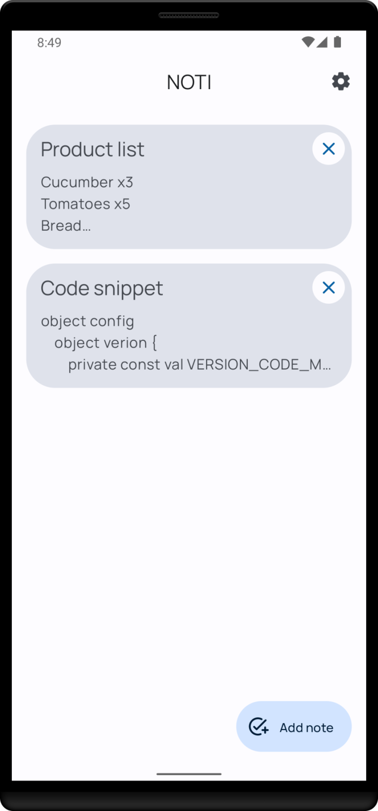
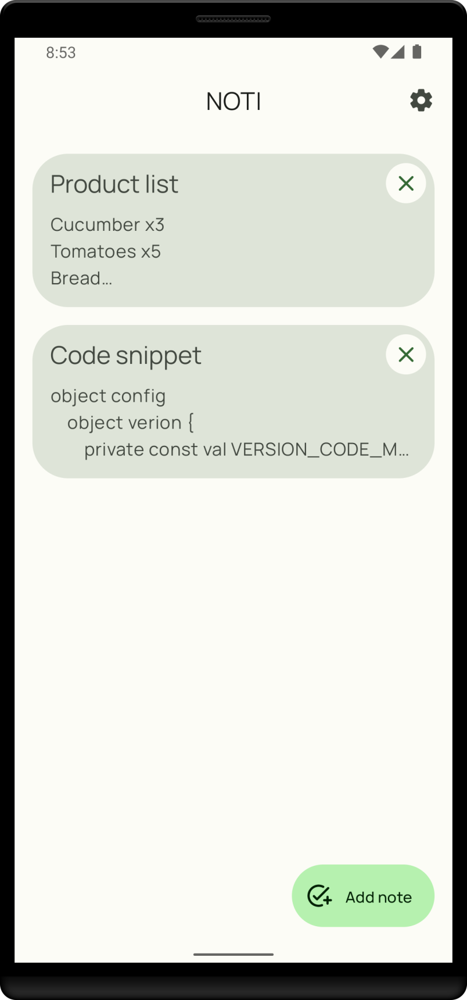
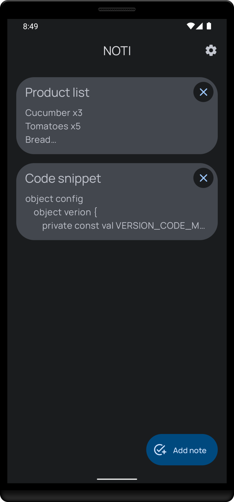
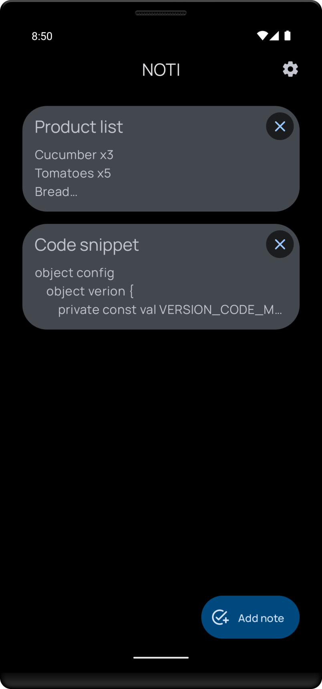
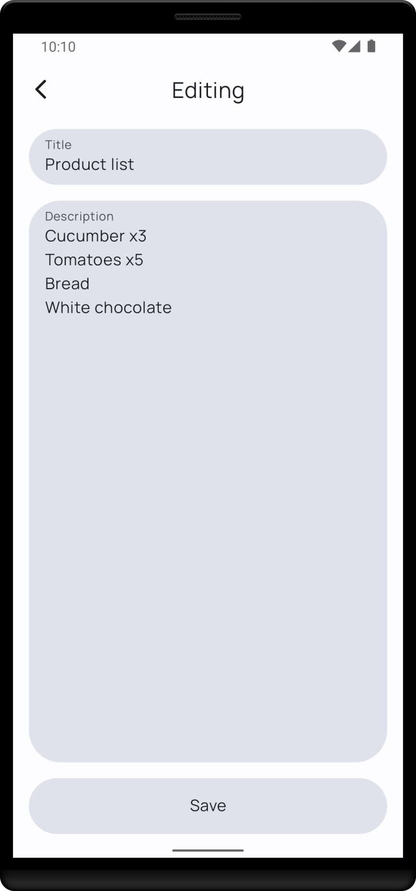
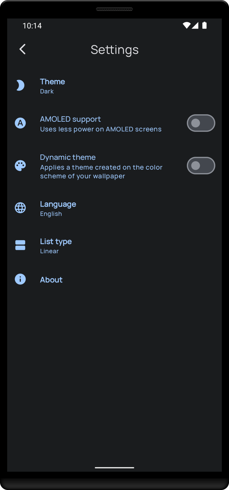

<h1 align="center">NOTI</h1>
<h3 align="center">Your simple note application</h3>

<p align="center">
    <a href="https://choosealicense.com/licenses/mit/"></a>
    <a href="https://android-arsenal.com/api"></a>
    <a href="https://github.com/SkyfaceD/noti/releases"></a>
    <a href="https://wakatime.com/projects/noti"></a>
</p>

# Download
<a href='https://play.google.com/store/apps/details?id=org.skyfaced.noti&pcampaignid=pcampaignidMKT-Other-global-all-co-prtnr-py-PartBadge-Mar2515-1'></a>
<a href='https://appgallery.huawei.com/app/C106876647'></a>
<a href='https://www.amazon.com/dp/B0B9NZ9X1G/ref=sr_1_2?crid=E70Z7LWY9ULN&keywords=noti+app&qid=1661438584&sprefix=noti+ap%2Caps%2C252&sr=8-2'></a>

or find it out on <a href='https://github.com/SkyfaceD/noti/releases'>releases section</a>

# Stack

- [Kotlin](https://kotlinlang.org/) - a modern programming language that makes developers happier
- [Jetpack Compose](https://developer.android.com/jetpack/compose) - is Android’s modern toolkit for
  building native UI
- [Square Logcat](https://github.com/square/logcat) - a tiny Kotlin API for cheap logging on top of
  Android's normal `Log` class.
- [Material Components](https://m3.material.io/) - an adaptable system of guidelines, components,
  and tools that support the best practices of user interface design
- [Coroutines](https://github.com/Kotlin/kotlinx.coroutines)
  and [Flow](https://developer.android.com/kotlin/flow) - asynchronous world
- [Lifecycle](https://developer.android.com/jetpack/androidx/releases/lifecycle) - perform actions
  in response to a change in the lifecycle status of another component, such as activities and
  fragments
- [ViewModel](https://developer.android.com/topic/libraries/architecture/viewmodel) - class is
  designed to store and manage UI-related data in a lifecycle conscious way
- [Navigation Components](https://developer.android.com/jetpack/compose/navigation) - helps you
  implement navigation, from simple button clicks to more complex patterns, such as app bars and the
  navigation drawer
- [DataStore](https://developer.android.com/topic/libraries/architecture/datastore) - is a data
  storage solution that allows you to store key-value pairs or typed objects with protocol buffers
- [Room](https://developer.android.com/training/data-storage/room) - the Room persistence library provides an abstraction layer over SQLite to allow fluent database access while harnessing the full power of SQLite

# Screenshots

<p align="center">
  &emsp;&emsp;&emsp;&emsp;&emsp;&emsp;
</p>

# Build

### Requirements
- Android Studio Chipmunk | 2021.2.1+
- Android SDK 21+
- Gradle 7.5+
- Java 11+

# Support

<a href="https://www.buymeacoffee.com/skyfaced" target="_blank"></a>

# License

```
MIT License

Copyright (c) 2022 Atabayev Muslim (@SkyfaceD)

Permission is hereby granted, free of charge, to any person obtaining a copy
of this software and associated documentation files (the "Software"), to deal
in the Software without restriction, including without limitation the rights
to use, copy, modify, merge, publish, distribute, sublicense, and/or sell
copies of the Software, and to permit persons to whom the Software is
furnished to do so, subject to the following conditions:

The above copyright notice and this permission notice shall be included in all
copies or substantial portions of the Software.

THE SOFTWARE IS PROVIDED "AS IS", WITHOUT WARRANTY OF ANY KIND, EXPRESS OR
IMPLIED, INCLUDING BUT NOT LIMITED TO THE WARRANTIES OF MERCHANTABILITY,
FITNESS FOR A PARTICULAR PURPOSE AND NONINFRINGEMENT. IN NO EVENT SHALL THE
AUTHORS OR COPYRIGHT HOLDERS BE LIABLE FOR ANY CLAIM, DAMAGES OR OTHER
LIABILITY, WHETHER IN AN ACTION OF CONTRACT, TORT OR OTHERWISE, ARISING FROM,
OUT OF OR IN CONNECTION WITH THE SOFTWARE OR THE USE OR OTHER DEALINGS IN THE
SOFTWARE.
```
